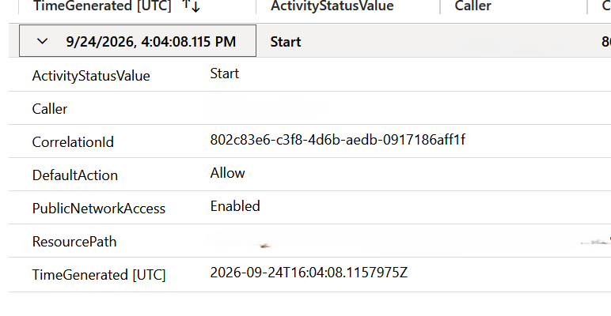
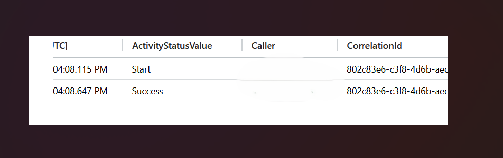
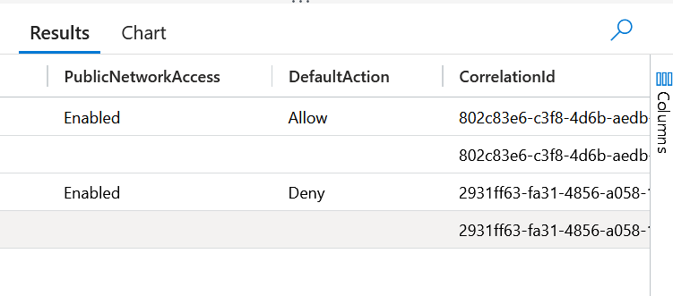
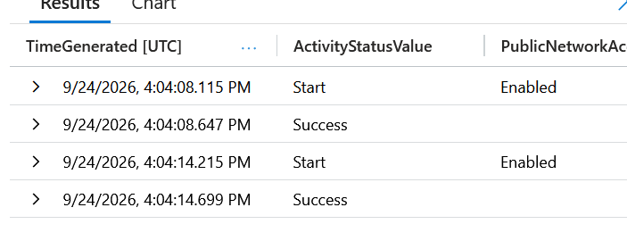
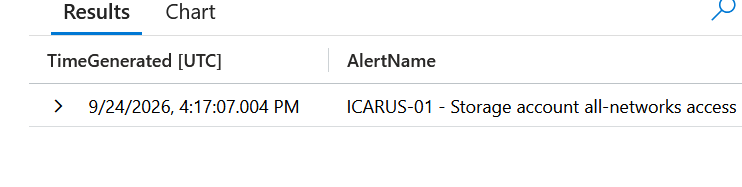
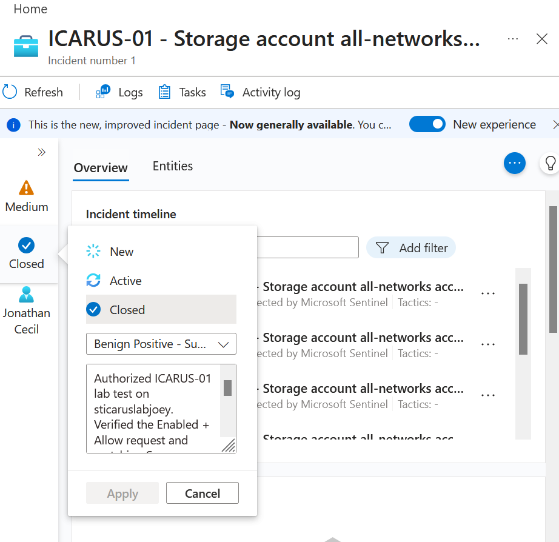
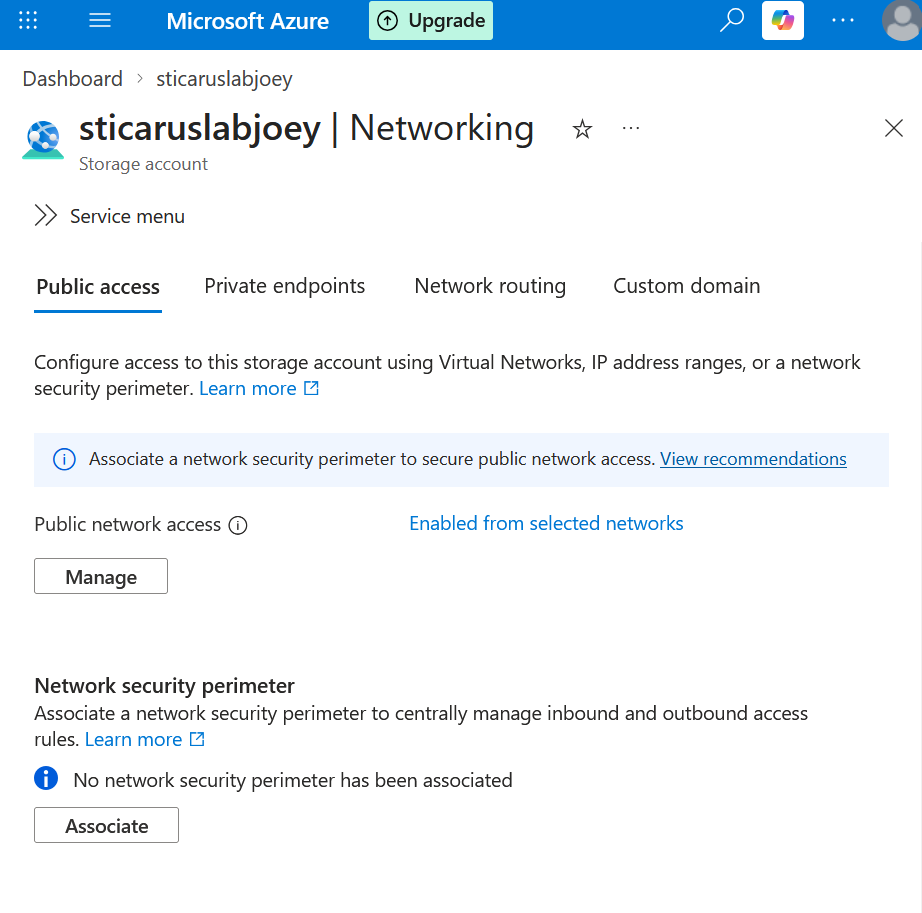

# ICARUS-01 — Storage Network Exposure Detection

## Objective

Detect an Azure Storage update that allows access from all networks, investigate whether the change succeeded, and verify restoration of selected-network access.

This was an authorized test in a personal Azure lab.

---

## Lab Environment

| Component | Resource |
|---|---|
| Resource group | RG-PROJECT-ICARUS |
| Storage account | sticaruslabjoey |
| Log Analytics workspace | law-project-icarus |
| Detection platform | Microsoft Sentinel |
| Log source | AzureActivity |
| Test date | September 24, 2026 |

---

## Key Concepts

- **PublicNetworkAccess = Enabled:** Public network access is enabled.
- **DefaultAction = Allow:** The network default action permits all networks.
- **DefaultAction = Deny:** Access is restricted according to configured network rules and exceptions.
- **CorrelationId:** Connects related events from the same operation.
- **Start versus Success:** A request must be matched to its completion event to establish whether the operation succeeded.

All-networks access does not, by itself, establish anonymous access to stored data.

---

## Detection Query

The following Kusto Query Language (KQL) query was deployed in a scheduled analytics rule:

```kusto
AzureActivity
| where OperationNameValue =~ "MICROSOFT.STORAGE/STORAGEACCOUNTS/WRITE"
| where tostring(Properties_d.resource) =~ "sticaruslabjoey"
| extend Request = parse_json(tostring(Properties_d.requestbody))
| extend
    PublicNetworkAccess = tostring(Request.properties.publicNetworkAccess),
    DefaultAction = tostring(Request.properties.networkAcls.defaultAction)
| where PublicNetworkAccess =~ "Enabled"
| where DefaultAction =~ "Allow"
| project
    TimeGenerated,
    ActivityStatusValue,
    Caller,
    CorrelationId,
    ResourcePath = tostring(Properties_d.entity),
    PublicNetworkAccess,
    DefaultAction
```

In the observed events, the request body was present on Start records but absent from the displayed Success records. The rule therefore detects the request; completion is verified during investigation.

The ResourceId column was blank in these records, so the query used resource information from Properties_d.

---

## Analytics Rule Settings

| Setting | Value |
|---|---|
| Rule name | ICARUS-01 - Storage account all-networks access |
| Rule type | Scheduled |
| Status | Enabled |
| Severity | Medium |
| Run frequency | Every 5 minutes |
| Lookback period | 1 hour |
| Alert threshold | More than 0 results |
| Event grouping | Trigger an alert for each event |
| Suppression | Off |
| Incident creation | Enabled |
| Incident grouping | All alerts from this rule within 1 hour |
| Reopen closed incidents | Disabled |
| Automated response | Not configured |

Entity mapping and custom details were not configured in this initial version.

---

## Test Procedure

1. Changed the storage account to allow access from all networks.
2. Saved the change.
3. Immediately restored selected-network access and saved.
4. Queried AzureActivity to verify both changes.
5. Confirmed the scheduled rule generated an alert and incident.

Restoration was performed manually as part of the test, before alert review.

---

## Investigation Timeline

All times are UTC on September 24, 2026.

| Time | Observed event |
|---|---|
| 16:04:08.115 | Update request started: Enabled + Allow |
| 16:04:08.647 | Matching update completed successfully |
| 16:04:14.215 | Restoration request started: Enabled + Deny |
| 16:04:14.699 | Restoration completed successfully |
| 16:17:07.004 | ICARUS-01 alert record appeared in SecurityAlert |
| Later in the session | Incident #1 investigated and closed |

The configuration requests were approximately six seconds apart. These timestamps do not establish the exact duration of effective network exposure.

---

## Investigation Steps

### 1. Confirm Alert Generation

The incident list initially appeared empty. I checked the workspace directly:

```kusto
SecurityAlert
| where TimeGenerated >= datetime(2026-09-24T16:00:00Z)
| where AlertName contains "ICARUS-01"
| project TimeGenerated, AlertName, AlertSeverity, SystemAlertId
| order by TimeGenerated desc
```

The results confirmed that the rule generated an alert.

### 2. Locate the Incident

```kusto
SecurityIncident
| where TimeGenerated >= datetime(2026-09-24T16:00:00Z)
| where Title contains "ICARUS-01"
| project TimeGenerated, IncidentNumber, Title, Status, IncidentUrl
| order by TimeGenerated desc
```

I opened Incident #1 using its IncidentUrl, changed its status to Active, and assigned it to myself.

The cause of the initial incident-list discrepancy was not conclusively established.

### 3. Inspect the Triggering Event

I followed the alert's event link into Log Analytics and confirmed:

- The caller matched the account used for the authorized test.
- PublicNetworkAccess was Enabled.
- DefaultAction was Allow.
- The event status was Start.
- A correlation ID was available for completion verification.

### 4. Verify Successful Completion

```kusto
AzureActivity
| where TimeGenerated between (
    datetime(2026-09-24T16:00:00Z) ..
    datetime(2026-09-24T17:00:00Z)
)
| where CorrelationId == "802c83e6-c3f8-4d6b-aedb-0917186aff1f"
| where OperationNameValue =~ "MICROSOFT.STORAGE/STORAGEACCOUNTS/WRITE"
| project TimeGenerated, ActivityStatusValue, Caller, CorrelationId
| order by TimeGenerated asc
```

The results showed Start followed by Success for the same operation.

### 5. Verify Remediation

The later request showed Enabled + Deny, followed by successful completion.

I also checked the storage account's Networking page and confirmed that selected-network access was restored.

---

## Findings

- The analytics rule detected the intended configuration change.
- The all-networks update completed successfully.
- The restoration update also completed successfully.
- Microsoft Sentinel generated an alert and Incident #1.
- Multiple alerts appeared for the same event time.
- The activity was authorized and expected as part of the lab.

No storage data-plane investigation was performed. This case does not claim that data was accessed or that no data access occurred.

---

## Response Actions

- Restored selected-network access immediately after the test change.
- Verified the restoration through logs and the current configuration.
- Assigned and investigated the incident.
- Recorded the investigation findings.
- Closed the incident as authorized test activity.

A conflict error occurred during closure. Refreshing the incident and retrying resolved the issue.

---

## Incident Report Summary

| Field | Result |
|---|---|
| Incident | #1 |
| Severity | Medium |
| Owner | Jonathan Cecil |
| Final status | Closed |
| Classification | Benign Positive — Suspicious but expected |
| Reason | Authorized lab test correctly detected |
| Remediation | Selected-network access restored and verified |

The benign-positive classification reflects a correct detection of expected activity.

---

## Evidence

Personal identifiers have been redacted where applicable.

### 1. Exposure request

The request event shows public network access enabled and the network default action set to Allow.



### 2. Successful completion

The Start and Success events were matched using the exposure request's correlation ID.



### 3. Restoration request

The logged settings show the Allow request followed by a Deny request to restore selected-network access.



### 4. Restoration completion

The event timeline shows Start and Success records for both updates. The restoration update completed at 16:04:14.699 UTC.



### 5. Alert generated

Microsoft Sentinel generated an ICARUS-01 alert recorded at 16:17:07.004 UTC.



### 6. Incident closed

The incident was closed as Benign Positive following investigation of the authorized lab test.



### 7. Current network settings

A subsequent portal check confirms that access is enabled from selected networks.



| Evidence | Purpose |
|---|---|
| Expanded triggering event | Show Enabled + Allow and the correlation ID |
| Matching Start and Success events | Establish successful execution |
| Restoration events | Show Enabled + Deny and successful completion |
| Generated alert | Demonstrate detection |
| Active, assigned incident | Demonstrate investigation ownership |
| Closed incident and classification | Demonstrate documented disposition |

---

## Recommendations

- Investigate repeated-alert behavior caused by overlapping query windows.
- Validate a deduplication approach without losing coverage for delayed events.
- Add entity mapping and useful custom details.
- Evaluate requests that omit one of the monitored settings.
- Validate broader resource coverage before extending the rule beyond this lab account.

These improvements have not yet been implemented.

---

## Security Lessons Learned

- An alert is the starting point for investigation.
- Request details and completion status may appear in separate events.
- Correlation IDs provide stronger evidence than matching timestamps alone.
- Successful remediation should be verified.
- Incident grouping does not eliminate duplicate alerts.
- Authorized activity can correctly trigger a security detection.
- Findings must remain within the limits of the available evidence.

---

## Interview Summary

Built and validated a Microsoft Sentinel rule for Azure Storage all-networks access. Investigated the triggering request, correlated it with successful completion, verified restoration of restricted access, and closed the incident with an evidence-based benign-positive classification.
