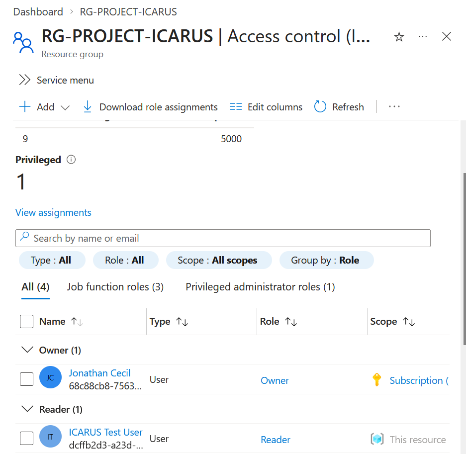
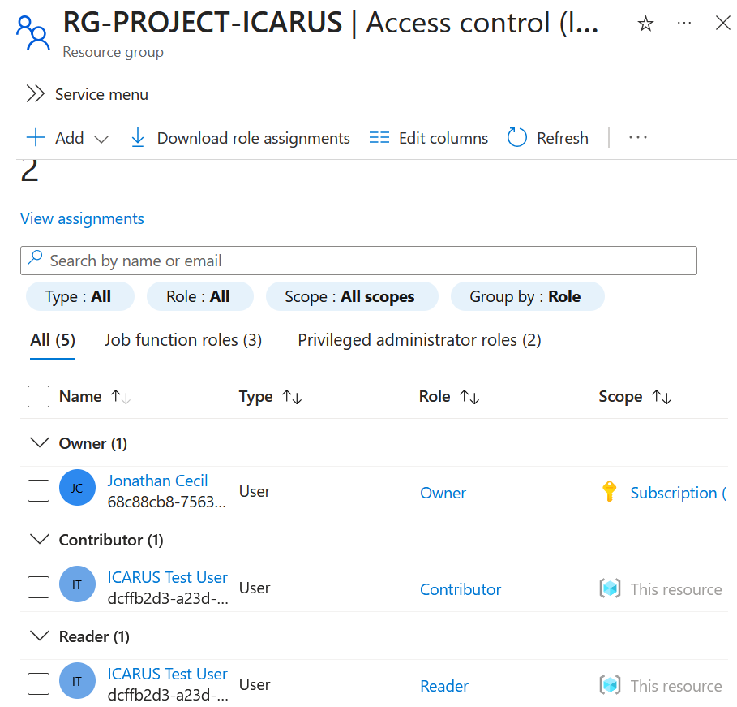
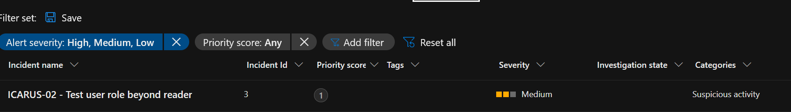
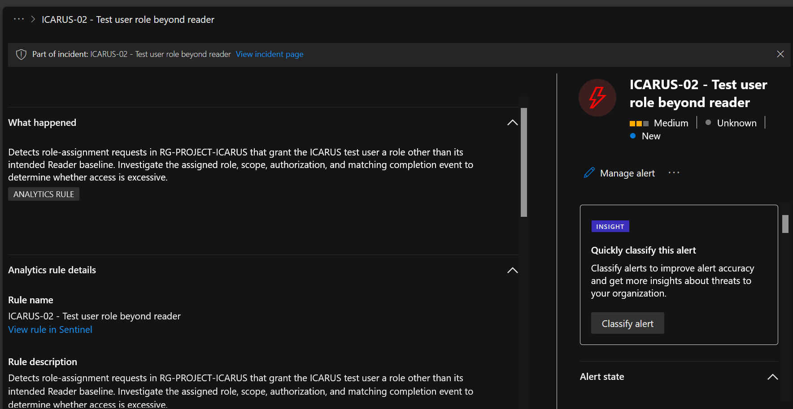
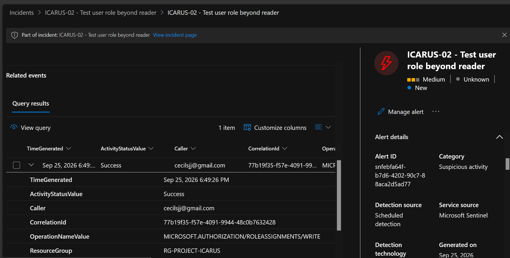
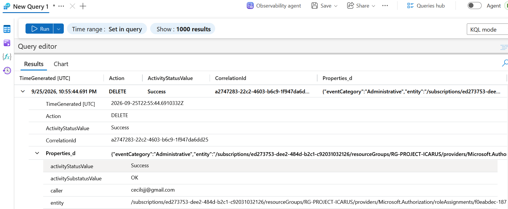
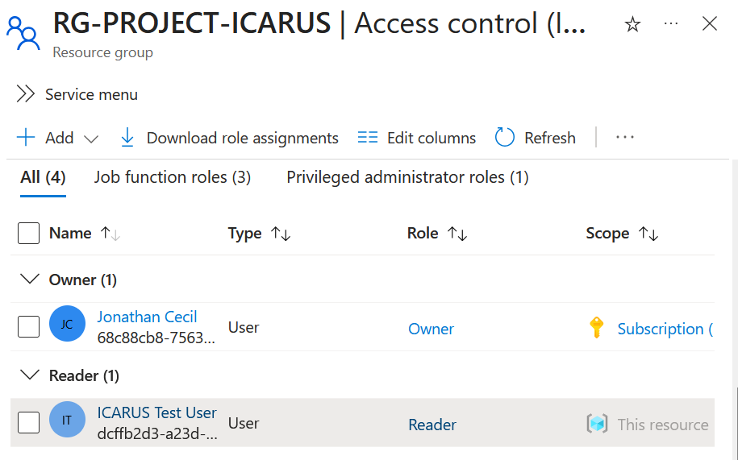
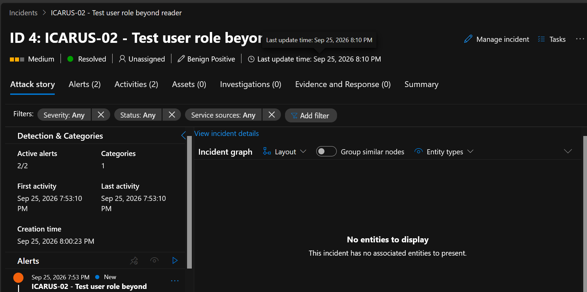

```markdown
# ICARUS-02 — Excessive RBAC Permission Detection

## Objective

Detect an Azure Role-Based Access Control (RBAC) change that grants the ICARUS test user permissions beyond the intended Reader baseline, investigate whether the role assignment succeeded, and verify removal of the excessive access.

This was an authorized test in a personal Azure lab.

---

## Lab Environment

| Component | Resource |
|---|---|
| Resource group | RG-PROJECT-ICARUS |
| Detection platform | Microsoft Sentinel | 
| Log source | AzureActivity |
| Access-control model | Azure RBAC |
| Test identity | ICARUS Test User |
| Baseline role | Reader |
| Elevated test role | Contributor |
| Test date | September 25, 2026 |

---

## Key Concepts

- **Reader:** Allows the user to view Azure resources without modifying them.
- **Contributor:** Allows the user to manage Azure resources but does not allow management of Azure RBAC role assignments.
- **Role assignment write:** Records the creation or modification of an Azure RBAC role assignment.
- **Role assignment delete:** Records the removal of an Azure RBAC role assignment.
- **CorrelationId:** Connects related Azure Activity Log events from the same operation.
- **Baseline validation:** Confirms that an identity returned to its intended access level after remediation.

A successful role-assignment event establishes that an RBAC change occurred. It does not, by itself, establish whether the activity was malicious or unauthorized.

---

## Detection Query

The following Kusto Query Language (KQL) query was deployed in a scheduled analytics rule:

```kusto
AzureActivity
| where OperationNameValue =~ "MICROSOFT.AUTHORIZATION/ROLEASSIGNMENTS/WRITE"
| where ActivityStatusValue =~ "Success"
| where ResourceGroup =~ "RG-PROJECT-ICARUS"
| project
    TimeGenerated,
    Caller,
    ResourceGroup,
    OperationNameValue,
    ActivityStatusValue,
    CorrelationId
| order by TimeGenerated desc
```

The query monitors successful Azure RBAC role-assignment write operations within `RG-PROJECT-ICARUS`.

The role name was not exposed directly in the projected AzureActivity fields used during the investigation. The assigned Contributor role was therefore validated through the Azure Access Control (IAM) configuration.

---

## Analytics Rule Settings

| Setting | Value |
|---|---|
| Rule name | ICARUS-02 - Test user role beyond reader |
| Rule type | Scheduled |
| Status | Enabled |
| Severity | Medium |
| Run frequency | Every 5 minutes |
| Lookback period | 1 hour |
| Alert threshold | More than 0 results |
| Suppression | Off |
| Incident creation | Enabled |
| Automated response | Not configured |

The initial version focused on detecting successful role-assignment changes in the ICARUS resource group.

---

## Test Procedure

1. Confirmed that the ICARUS Test User had Reader access.
2. Assigned the Contributor role to the test user.
3. Verified that Reader and Contributor were both present in Access Control (IAM).
4. Allowed the scheduled analytics rule to process the new Azure Activity Log event.
5. Confirmed that Microsoft Sentinel generated an alert and incident.
6. Investigated the underlying RBAC write event.
7. Removed the temporary Contributor role.
8. Verified that the account returned to Reader-only access.
9. Resolved the Sentinel incident as authorized security testing.

The Contributor role was intentionally assigned as part of the controlled test.

---

## Investigation Timeline

All times are UTC on September 25, 2026.

| Event | Observed activity |
|---|---|
| Baseline | ICARUS Test User confirmed with Reader access |
| Privilege change | Contributor role assigned to ICARUS Test User |
| Detection | Successful role-assignment write recorded in AzureActivity |
| Alert | Microsoft Sentinel generated the ICARUS-02 alert |
| Incident | Medium-severity ICARUS-02 incident created |
| Investigation | RBAC write event reviewed in Sentinel |
| Remediation | Contributor role assignment removed |
| Validation | ICARUS Test User confirmed as Reader only |
| Closure | Incident resolved as authorized security testing |

The Azure Activity Log provided control-plane evidence of the RBAC role-assignment change and subsequent removal.

---

## Investigation Steps

### 1. Confirm the Reader Baseline

I reviewed Access Control (IAM) and confirmed that the ICARUS Test User initially had the Reader role.

This established the intended access baseline before the test.

### 2. Generate the Excessive-Permission Condition

I temporarily assigned the Contributor role to the ICARUS Test User.

Access Control (IAM) showed both:

- Reader
- Contributor

The Contributor assignment represented the excessive-permission condition being tested.

### 3. Confirm Sentinel Detection

Microsoft Sentinel generated a Medium-severity incident titled:

```text
ICARUS-02 - Test user role beyond reader
```

The incident confirmed that the scheduled analytics rule detected the RBAC activity.

### 4. Inspect the Triggering Event

I opened the Sentinel alert and reviewed the underlying Azure Activity Log evidence.

The investigation confirmed:

- `ActivityStatusValue` was `Success`.
- `OperationNameValue` was `MICROSOFT.AUTHORIZATION/ROLEASSIGNMENTS/WRITE`.
- `ResourceGroup` was `RG-PROJECT-ICARUS`.
- The caller responsible for the operation was recorded.
- A correlation ID was available for the event.
- The detection source was a scheduled Microsoft Sentinel rule.

The successful write event confirmed that a role assignment had been created.

The AzureActivity fields reviewed during the investigation did not directly expose the human-readable role name. The Contributor assignment was independently confirmed through Access Control (IAM).

### 5. Verify Remediation

The temporary Contributor role assignment was removed.

Azure Activity Logs recorded a successful:

```text
Microsoft.Authorization/roleAssignments/delete
```

operation for the role assignment.

I then returned to Access Control (IAM) and confirmed that the ICARUS Test User had only the Reader role.

This verified that the excessive access had been removed and the intended baseline was restored.

---

## Findings

- The ICARUS Test User initially had Reader access.
- Contributor access was successfully added during the controlled test.
- Azure Activity Logs recorded the RBAC role-assignment write.
- Microsoft Sentinel detected the activity and generated a Medium-severity incident.
- The underlying event showed a successful `roleAssignments/write` operation.
- The caller, resource group, operation, and correlation ID were available for investigation.
- The Contributor assignment was successfully removed.
- Azure Activity Logs recorded the role-assignment deletion.
- Reader-only access was restored after remediation.
- The activity was authorized and expected as part of the lab.

The observed telemetry confirms that an RBAC role assignment was created and later removed. The investigation does not claim that the elevated permissions were used to modify Azure resources.

---

## Response Actions

- Investigated the Microsoft Sentinel incident.
- Reviewed the underlying Azure Activity Log event.
- Confirmed the successful RBAC role-assignment write.
- Verified the affected resource group and caller.
- Removed the temporary Contributor role assignment.
- Verified the role-assignment deletion in Azure Activity Logs.
- Confirmed that the ICARUS Test User returned to Reader-only access.
- Resolved the incident as authorized security testing.

---

## Incident Report Summary

| Field | Result |
|---|---|
| Incident | ICARUS-02 - Test user role beyond reader |
| Severity | Medium |
| Final status | Resolved |
| Classification | Benign Positive |
| Classification reason | Security testing |
| Detection | Successful Azure RBAC role-assignment write |
| Affected identity | ICARUS Test User |
| Elevated role | Contributor |
| Baseline role | Reader |
| Remediation | Contributor assignment removed |
| Validation | Reader-only access restored |

The benign-positive classification reflects a correct detection of intentionally generated security-test activity.

---

## Evidence

Personal identifiers should be redacted where applicable before public publication.

### 1. Reader baseline

The ICARUS Test User initially had Reader access, establishing the expected access baseline.



### 2. Temporary Contributor assignment

The test user was temporarily assigned Contributor access while the existing Reader assignment remained present.



### 3. Sentinel incident generated

Microsoft Sentinel generated a Medium-severity ICARUS-02 incident after detecting the RBAC activity.



### 4. Sentinel alert investigation

The alert documented the purpose of the detection and identified the activity as suspicious role-assignment behavior requiring investigation.



### 5. RBAC write event

The underlying Azure Activity Log evidence showed a successful `Microsoft.Authorization/roleAssignments/write` operation and exposed the caller, resource group, operation, and correlation ID.



### 6. Role assignment removed

Azure Activity Logs recorded the successful deletion of the temporary role assignment.



### 7. Reader baseline restored

After remediation, the ICARUS Test User was verified as having only Reader access.



### 8. Incident resolved

The Microsoft Sentinel incident was resolved after investigation and remediation.



| Evidence | Purpose |
|---|---|
| Reader baseline | Establish intended access before the test |
| Contributor assignment | Demonstrate the excessive-permission condition |
| Generated Sentinel incident | Demonstrate detection |
| Sentinel alert | Show detection context |
| Expanded RBAC write event | Establish successful role-assignment activity |
| Role-assignment deletion | Demonstrate remediation |
| Reader-only validation | Confirm restoration of intended access |
| Resolved incident | Demonstrate documented disposition and closure |

---

## Recommendations

- Add entity mapping for the affected identity and Azure resource where supported.
- Add useful custom details such as caller, correlation ID, operation, and resource group to the Sentinel alert.
- Evaluate detection logic that distinguishes expected Reader assignments from higher-privilege role assignments.
- Evaluate methods for resolving the role definition directly from activity data or related Azure RBAC telemetry.
- Investigate duplicate-alert behavior when overlapping query windows repeatedly process the same activity.
- Consider monitoring role-assignment deletions alongside creation events for a complete privilege-change timeline.
- Validate the detection against additional Azure roles before expanding it beyond the lab scenario.

These improvements have not yet been implemented.

---

## Security Lessons Learned

- RBAC changes are important cloud-security events because they can materially change what an identity is allowed to do.
- A successful role-assignment write should be investigated in context rather than automatically treated as malicious.
- The Azure Activity Log can provide evidence of RBAC control-plane changes.
- The role visible in Access Control (IAM) can provide important context when the activity event does not expose a human-readable role name.
- Sentinel alerts should lead to investigation of the underlying event rather than being treated as proof by themselves.
- Remediation should be followed by validation that the intended access baseline has been restored.
- Role-assignment deletion events provide useful evidence that excessive access was removed.
- Authorized security testing can correctly generate a security incident.
- Final disposition should distinguish correct detection from malicious activity.
- Findings must remain within the limits of the available evidence.

---

## Interview Summary

Built and validated a Microsoft Sentinel rule for Azure RBAC privilege changes. Established a Reader baseline, simulated excessive access by assigning Contributor, investigated the resulting successful role-assignment write event, removed the elevated permission, verified restoration of Reader-only access, and resolved the incident with an evidence-based benign-positive security-testing classification.
```

